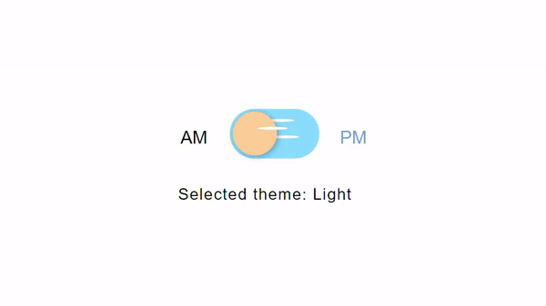

# react-theme-switcher
A dark-light theme switcher for React applications



## Bonus Feature:
Internationalization provides following features:
- detect the user language
- load the translations
- optionally cache the translations
- flexibility to use other packages eg: moment.js for date formatting
- scalability — option to separate translations into multiple files and to load them on demand

## Directory structure
```src
---- components  // all react components
-------- shared  // shared react components
---- locale      // translation files
-------- en.json // english translations
-------- jp.json // japanese translations
...
---- providers   // providers, custom hooks and HoC
---- App.css     // app styles
---- App.js      // App component
---- i18n.js     // is the i18next library configuration and initialization point
---- index.js    // is the JavaScript entry point
```
